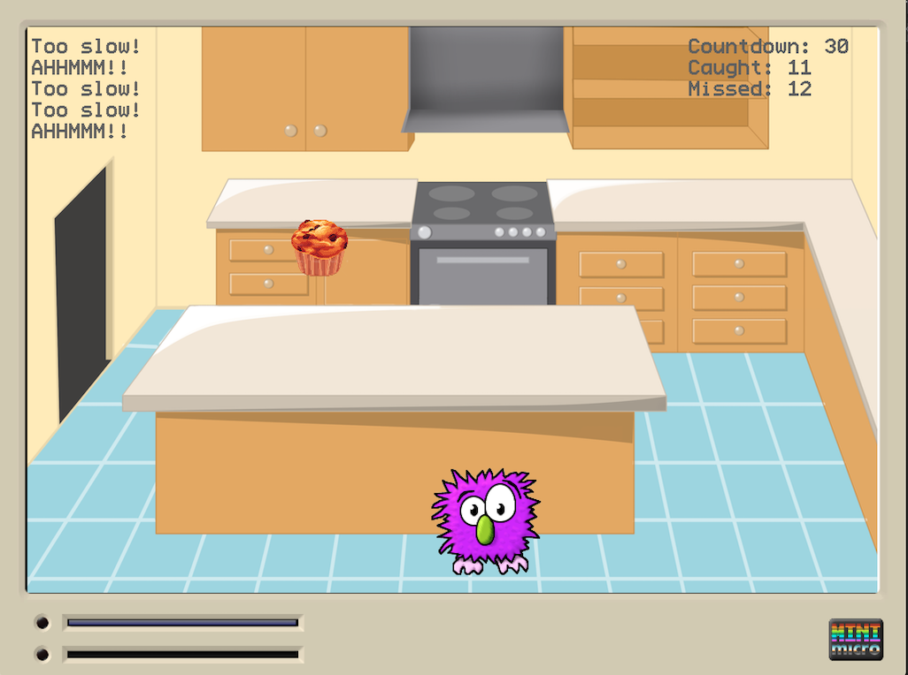

# Feed the Wumpus

This is simple catch-the-falling-object (in this case a delicious muffin) game for the [Mini Micro](https://miniscript.org/MiniMicro/index.html) virtual computer.

In this game you play the nice monster Wumpus, who tries to eat as many muffins as possible in the given time. He might miss one from time to time. It's OK.

## Aspects covered

This game was done for illustration purposes, to learn about these Mini Micro aspects, among others:

* Sprites
  * Placement
  * Movement
  * Rotation
  * Collision detection using bounds
* Sounds (loading / playing)
* Key event handling
* Calculating timeouts
* Rendering text on the screen
* and probably others ...

## Gameplay

Move the Wumpus with your arrow keys left and right.

Try to catch as many muffins as possible in the given time.

To quit you can press the "Q" key or ESC on your keyboard.
